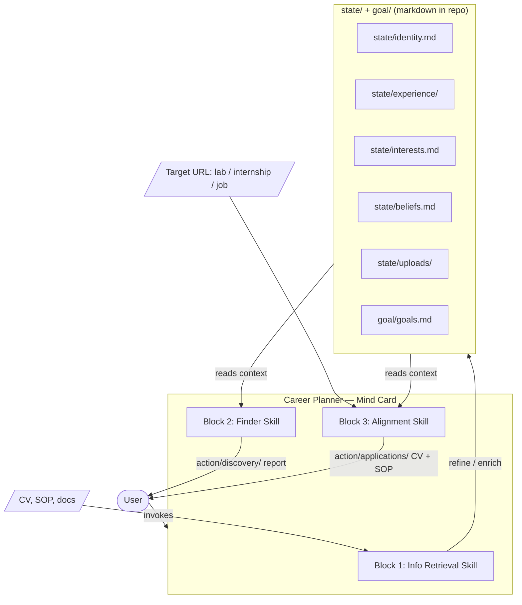
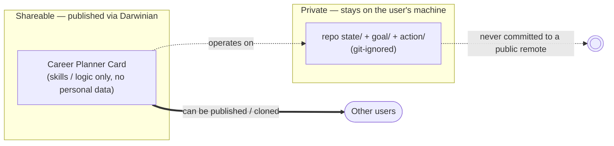
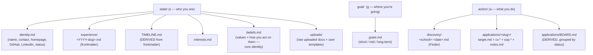
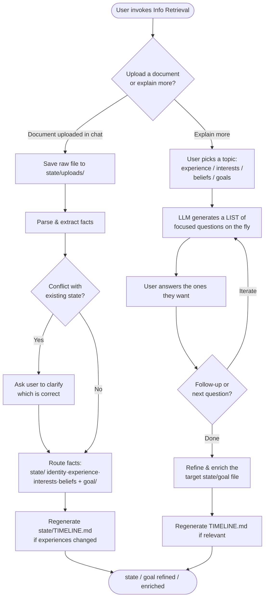
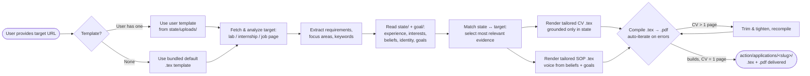
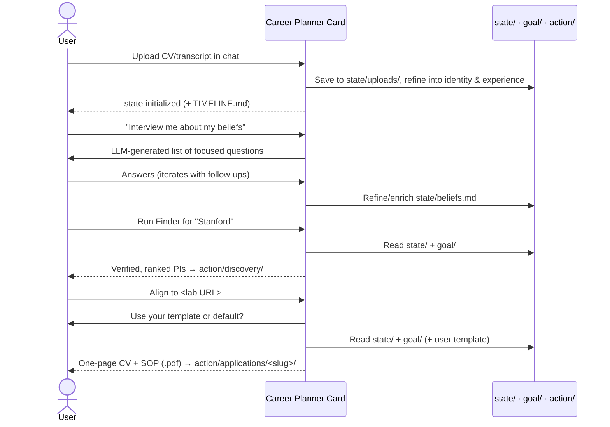

# PRD: Career Planner — Darwinian Mind Card

**Status:** Draft · **Project:** `career-planner@0.2` · **Card:** `@junggyubae/career-planner-card@0.2.4`
**Owner:** dev@greekwaters.io
**Last updated:** 2026-07-02
**Runtime:** Darwinian Mind Card running in Codex-first local agent workflows (also materializes Claude-compatible skills)

> **Data model (v0.2.4):** `state · goal · action` (see §5). The card is the policy `π(action | state, goal)`. §5 is authoritative.

---

## 1. Introduction / Overview

The **Career Planner** is a single **Darwinian Mind Card** that helps a person plan their next career step — with a bias toward academic and research paths (labs, internships, hiring companies). The card bundles a small set of skills that operate over a **file-based career state** stored as markdown inside the repo.

The card does three things (three "blocks"):

1. **Info Retrieval** — build and enrich the user's `state/` and `goal/`, either by importing uploaded documents from chat (CV, SOP, transcript, resume, etc.) or by running a focused **interview** on a topic. Both paths only refine/enrich.
2. **Finder (PI Finder in v1)** — the user names a **target school/institution**, and the card performs **deep research** to discover **Principal Investigators (PIs) / labs** at that school whose work fits the user's state, beliefs, and goals.
3. **Alignment** — given a **URL** for a specific target (a lab, an internship, a job), generate a **tailored CV and SOP** grounded in the user's state, beliefs, and goals, output as **LaTeX (`.tex`) compiled to `.pdf`**.

The whole system is deliberately simple: no separate app, no database. The **repo is the product**. Career state lives as markdown files that both the human and the agent can read, diff, and version locally.

**Problem it solves:** Career planning is fragmented — your history lives in old CVs, your goals live in your head, and tailoring materials for each opportunity is slow and repetitive. Career Planner centralizes a durable, structured state of who you are and automates the two highest-friction tasks: *finding* the right next step and *aligning* your materials to it.

---

## 2. Goals

- Provide **one Mind Card** that exposes three skills over shared, file-based `state/`, `goal/`, and `action/`.
- Make state **human-readable and hand-editable** — every fact is a markdown file the user can inspect and edit.
- Let a user grow their state two ways: **chat upload → save to `state/uploads/` → refine**, and **interview → refine/enrich**.
- Given a target school, surface **real PIs/labs** via deep research, ranked by fit against the user's state, beliefs, and goals.
- Generate a **tailored CV and SOP** for any target URL, drawing only from verified state (no fabrication), delivered as **`.tex` + compiled `.pdf`** using the user's template or a bundled default.
- Keep the state schema **stable and extensible** (identity, experience, uploads, interests, beliefs, goals).
- Enforce a clean **shareable-vs-private split**: the card (logic) is shareable; the state/goal/action data (personal data) is git-ignored and never leaves the user's machine.
- Restrict state/goal mutations to **refine and enrichment only** — no destructive overwrite or deletion.

---

## 3. Non-Goals (Out of Scope for v1)

- **No standalone UI / web app / backend.** The card runs in Codex over the repo; ChatGPT launchability would require a separate Apps SDK/MCP wrapper.
- **Finder v1 is PI-finding only.** The user must name a target school; Finder discovers PIs/labs there. Internships and company/industry roles, and job-board/ATS integrations (LinkedIn/Indeed/Greenhouse APIs, auto-apply), are **Phase 2**.
- **No school-less / fully-open discovery in v1.** Finder needs a school to scope research; open-ended "find me anything anywhere" is deferred.
- **No auto-submission** of applications or emails on the user's behalf.
- **No multi-user / accounts / auth.** Single-user, single-repo.
- **No DOCX/HTML output in v1.** Alignment outputs LaTeX compiled to PDF only; other formats can come later.
- **No automated background scheduling.** The card acts when invoked.

---

## 4. System Overview

### 4.1 The Card and its three blocks

### 4.2 How the blocks relate

- **Info Retrieval writes** to `state/` and `goal/`. **Finder and Alignment read** from them and write to `action/`. This read/write split keeps the source of truth clean.
- Info Retrieval has **two entry paths** that both end at enriched state/goal: the **upload path** and the **interview path**. **Both paths refine and enrich** — the interview is not merely appending, it refines existing facts too.
- The only operations allowed on `state`/`goal` are **refine** and **enrichment**. No skill destructively overwrites or deletes user-authored content.
- Finder and Alignment never invent facts — they are grounded strictly in what `state` contains.

### 4.3 Why a card *and* a repo (the privacy split)

The card and the repo are separated on purpose, along a **shareable vs. private** boundary:

- **The card is shareable.** It bundles only the *logic* — the three skills, the interview scripts, the research/alignment behavior. It carries **no personal data**, so it can be published and reused by anyone via the Darwinian sharing flow.
- **The repo's data is private.** `state/`, `goal/`, and `action/` are **git-ignored** so a user never accidentally pushes their CV, SOP, identity, interests, beliefs, goals, or applications to a public remote. The data lives locally with the user.

**Implication:** installing/sharing the card gives someone the *capability*; their own data stays theirs. Two users can run the identical card against completely separate, private state/goal/action.

---

## 5. Data Design — `state · goal · action` (v0.2.4)

> **v0.2.0 model change (current: v0.2.4).** The earlier `memory/` + `output/` layout was replaced by this RL-shaped model. The card is the **policy** `π(action | state, goal)`. This section is the data model of record.

Every fact is a markdown file so it is diffable, greppable, and editable by hand. Structured items carry **YAML frontmatter**, and indexes are **derived** (regenerated by the agent), never hand-maintained.

### 5.1 Structure

### 5.2 Responsibilities

| Path | Contents | Written by | Read by |
|------|----------|------------|---------|
| `state/identity.md` | name, contact, homepage, GitHub, LinkedIn, IDs, current status | Info Retrieval | Finder, Alignment |
| `state/experience/*.md` | one frontmatter-dated file per item | Info Retrieval | Finder, Alignment |
| `state/TIMELINE.md` | time-ordered index — **derived** from frontmatter | Info Retrieval (regenerates) | humans, Finder, Alignment |
| `state/interests.md` | research/career interests | Info Retrieval | Finder, Alignment |
| `state/beliefs.md` | **values + how you act on them — the core identity** | Info Retrieval | **Finder (values/culture fit)** + **Alignment (SOP voice + fit)** |
| `state/uploads/` | raw uploaded docs + user's own template | Info Retrieval | Info Retrieval, Alignment (template) |
| `goal/goals.md` | short / mid / long-term goals | Info Retrieval | **Finder** (direction) + **Alignment** (trajectory) |
| `action/discovery/*.md` | Finder PI/lab reports | Finder | humans |
| `action/applications/<slug>/` | `target.md` (+frontmatter/status), `cv.*`, `sop.*`, `notes.md` | Alignment | humans |
| `action/applications/BOARD.md` | pipeline index — **derived**, grouped by `status` | Alignment (regenerates) | humans |

### 5.3 Derived indexes (no drift)

`state/TIMELINE.md` and `action/applications/BOARD.md` are **generated** from the frontmatter of the underlying files — never a second hand-maintained source of truth. Timeline entries link back to their source `state/experience/*.md` files. This removes the drift risk of the old `_manager.md` spine: edit or add a file, regenerate the index.

### 5.4 Experience file body

Experience frontmatter is only the index: title, type, dates, organization, tags, and highlight. Richer detail belongs in the Markdown body below the frontmatter, using sections such as Summary, Responsibilities, Technical Work, Outcomes, Reflection, and Source. This keeps machine-sortable metadata compact while preserving the full story for Finder and Alignment.

---

## 6. Block Flows

### 6.1 Block 1 — Info Retrieval (two paths)

**Upload path:** the user uploads a CV, resume, transcript, SOP draft, research statement, or template in chat. The card saves the raw file to `state/uploads/`, keeps the original untouched, extracts structured facts, and **refines them into `state/` and `goal/`**. New experiences are added as frontmatter files with richer details in the Markdown body, and the derived `state/TIMELINE.md` is regenerated with links back to those source files. **If any extracted fact conflicts with existing state** (e.g. different dates or titles for the same role), the card **always stops and asks the user to clarify** which is correct — it never silently picks a winner.

**Interview path:** the user wants to say more about a topic. The card **generates a list of focused questions on the fly** (no fixed bank, adapted to what's already in `state`/`goal`), the user answers the ones they want, and the card **iterates** with follow-ups. Answers **refine and enrich** the relevant file — beliefs being the topic to probe deepest. Both paths perform only refine/enrichment; neither destroys prior content.

### 6.2 Block 2 — Finder (PI Finder, deep research)

```mermaid
flowchart LR
    S([User invokes Finder]) --> S0[/User names a<br/>target school/institution/]
    S0 --> R1[Read state/ + goal/:<br/>identity, experience,<br/>interests, beliefs, goals]
    R1 --> R2[Form a research profile:<br/>skills, level, interests,<br/>beliefs/values, goal direction]
    R2 --> R3[Deep research the school:<br/>discover PIs / labs there]
    R3 --> Rv[Verifier pass:<br/>confirm each PI is CURRENTLY<br/>at the school & active]
    Rv --> R4[Rank survivors by fit:<br/>topical + belief + goal]
    R4 --> R5[Produce PI report → action/discovery/:<br/>lab link, PI, why-it-fits, verified]
    R5 --> Out([Report delivered to user])
```

**v1 behavior:** the user **names a target school**. Finder reads `state/` + `goal/`, forms a research profile, runs **deep research scoped to that school**, then a **verifier pass** confirms each PI is currently at the school and active before ranking. Output (to `action/discovery/`) is a **ranked report** — each PI has a lab link, a "why this fits you" grounded in specific `state`/`goal` facts, and a verification note.

**Phase 2 (noted, out of scope now):** internships and company/industry roles, school-less open discovery, structured source integrations (job boards, lab directories), saved searches, and periodic re-runs.

### 6.3 Block 3 — Alignment (URL → tailored CV + SOP)

**v1 behavior:** the user pastes a URL for a specific target. Alignment first resolves the **template** (user's own from `state/uploads/`, else the bundled default), fetches and analyzes the target, matches it against `state`, and renders a **tailored CV and SOP as LaTeX**. It **compiles with `pdflatex`, auto-iterating on errors until the PDF builds**, and **enforces a strictly one-page CV** (trim + tighten + recompile). Everything is grounded in `state` — **no fabricated experience**. The SOP leans on `beliefs` and `goals` to sound like the user and argue fit. Output lands in `action/applications/<slug>/`.

### 6.4 End-to-end sequence (typical first session)

---

## 7. User Stories

### US-001: Scaffold the state/goal/action folder structure
**Description:** As a user, I want the repo to contain the folder skeleton so the card has known places to read state, goals, and write actions.

**Acceptance Criteria:**
- [ ] `state/` contains skeleton READMEs for identity, experience, uploads, interests, and beliefs.
- [ ] `goal/` contains a skeleton README for goals.
- [ ] `action/` contains skeleton READMEs for discovery and applications.
- [ ] `state/TIMELINE.md` and `action/applications/BOARD.md` are documented as derived indexes, not hand-maintained files.

### US-002: Author the Career Planner Mind Card
**Description:** As a user, I want a single Darwinian Mind Card that registers the three skills so I can invoke the whole system from Codex.

**Acceptance Criteria:**
- [ ] A card source is created via the Darwinian authoring flow
- [ ] The card bundles three skills: Info Retrieval, Finder, Alignment
- [ ] The card applies cleanly to the project with `drwn write` (materializes skills without errors)
- [ ] Inspecting the card shows all three skills active

### US-003: Info Retrieval — upload path
**Description:** As a user, I want to upload documents in chat and have them saved and refined into state/goals so I do not have to type my history manually.

**Acceptance Criteria:**
- [ ] Raw uploaded file is saved under `state/uploads/`
- [ ] Facts are routed to the correct file (`state/identity.md`, `state/experience/*.md`, `state/interests.md`, `state/beliefs.md`, or `goal/goals.md`)
- [ ] Each distinct experience becomes its own file under `state/experience/`
- [ ] Experience YAML frontmatter remains compact; richer details go in the Markdown body
- [ ] `state/TIMELINE.md` is regenerated in reverse chronological order and each entry links to its source experience file
- [ ] Uploaded CV/SOP LaTeX templates stay in `state/uploads/` for Alignment instead of being extracted as experience
- [ ] On any conflict with existing state, the card **stops and asks the user to clarify** (never auto-resolves)
- [ ] No fact is invented — only what appears in the source is stored

### US-004: Info Retrieval — interview path
**Description:** As a user, I want the card to interview me about a topic so I can add depth documents do not capture, and refine facts that are already there.

**Acceptance Criteria:**
- [ ] User can name a topic (a specific experience, interest, or belief)
- [ ] Card first presents a **list of focused questions** for the topic, then **iterates** with follow-ups
- [ ] User can answer a subset; unanswered questions don't block progress
- [ ] Answers **refine and enrich** the correct state/goal file — new detail is added and existing facts can be sharpened, but nothing is destructively overwritten
- [ ] `state/TIMELINE.md` is regenerated if an experience changed
- [ ] Interview ends when the user signals enough depth

### US-005: Finder — PI finder for a target school
**Description:** As a user, I want to name a school and get a ranked list of PIs/labs there that fit me.

**Acceptance Criteria:**
- [ ] Card requires the user to name a target school before researching
- [ ] Finder reads the full `state/` and `goal/`, including `state/beliefs.md`, before researching
- [ ] Output is a ranked list of **PIs/labs at that school**
- [ ] Each item includes the lab link, PI name, current-affiliation verification, recent activity signal, and a "why it fits" tied to specific state, belief, interest, and goal facts
- [ ] The report is saved to `action/discovery/<school>-<date>.md`

### US-006: Alignment — tailored CV + SOP from a URL (LaTeX → PDF)
**Description:** As a user, I want to give a target URL and get a CV and SOP tailored to it, grounded in my state, as polished PDFs.

**Acceptance Criteria:**
- [ ] Card asks whether to use the user's own template or the default; uses the user's `state/uploads/` template if present, else the bundled default
- [ ] Card fetches and summarizes the target's requirements/focus
- [ ] CV and SOP are generated using only facts present in `state/`
- [ ] SOP reflects the user's voice using `state/beliefs.md`, `state/interests.md`, and `goal/goals.md`
- [ ] Each target gets its own folder `action/applications/<target-slug>/` containing `target.md`, `cv.tex`/`cv.pdf`, `sop.tex`/`sop.pdf`, and `notes.md`
- [ ] Outputs are rendered as `.tex` **and compiled to `.pdf`** via `pdflatex`
- [ ] CV is strictly one page; if too long, it is trimmed/tightened and recompiled
- [ ] `action/applications/BOARD.md` is regenerated from `target.md` frontmatter
- [ ] A short "coverage note" flags any target requirement not backed by state

### US-007: Bundle default LaTeX templates
**Description:** As a user without my own template, I want a good-looking default CV/SOP so I get a usable PDF out of the box.

**Acceptance Criteria:**
- [ ] A default `cv-template.tex` and `sop-template.tex` ship **with the card** (shareable, no personal data)
- [ ] Templates compile to PDF cleanly with a standard LaTeX toolchain
- [ ] Templates use clear placeholder fields that Alignment fills from state
- [ ] Alignment falls back to these when the user has no template in `state/uploads/`

### US-008: State stays private and human-editable
**Description:** As a user, I want my state, goals, and actions to be plain, editable files that never get pushed to a public remote.

**Acceptance Criteria:**
- [ ] All state, goal, and action artifacts are plain markdown or local generated files
- [ ] `state/`, `goal/`, and `action/` contents are listed in `.gitignore` (personal data is never committed), while skeleton READMEs remain tracked
- [ ] The shareable card contains **no** personal data
- [ ] A user hand-editing a state file does not break any skill

---

## 8. Functional Requirements

- **FR-1:** The system must expose exactly one Mind Card that bundles three skills: Info Retrieval, Finder, Alignment.
- **FR-2:** The system must store structured state/action data as markdown files: `state/` (identity, experience, interests.md, beliefs.md), `goal/` (goals.md), and `action/` (discovery/, applications/). Raw uploaded files remain in their original formats under `state/uploads/`.
- **FR-3:** Info Retrieval must support an **upload path**: the user uploads files in chat, the card saves the raw files to `state/uploads/`, then refines extracted facts into `state/` and `goal/`.
- **FR-4:** Info Retrieval must support an **interview path**: present a **list of focused questions** on a chosen topic (experience/interests/beliefs/goals — beliefs being the core-identity topic to invest most in), iterate with follow-ups, and refine/enrich the correct file.
- **FR-5:** Each experience must be a separate markdown file **with frontmatter** and a freeform Markdown body for richer detail; `state/TIMELINE.md` is **derived** from that frontmatter (not hand-maintained) and links each entry to its source file.
- **FR-6:** Finder must require a **target school**, read `state/` + `goal/`, then run deep research scoped to that school to produce a ranked **PI/lab** report (`action/discovery/`) grounded in state, beliefs, and goal direction.
- **FR-7:** Alignment must accept a target URL, resolve a template (user-provided from `state/uploads/` or the bundled default), analyze the target, and generate a tailored CV and SOP grounded strictly in `state`, rendered as **`.tex` and compiled to `.pdf`** into `action/applications/<slug>/`; the CV must be exactly one page.
- **FR-8:** No skill may fabricate facts not present in `state` or the analyzed target; unsupported claims must be flagged, not invented.
- **FR-9:** The only operations any skill may perform on `state`/`goal` are **refine** and **enrichment**. Destructive overwrite or deletion of user-authored content is not permitted.
- **FR-10:** `state/`, `goal/`, and `action/` must be git-ignored; the shareable card must contain no personal data.
- **FR-11:** When Info Retrieval detects a conflict between new input and existing state, it must **stop and ask the user to clarify**; it must not auto-resolve.
- **FR-12:** The card must ship **default `cv-template.tex` and `sop-template.tex`** (containing no personal data) used when the user has not provided their own template.

---

## 9. Technical Considerations

- **Runtime:** Darwinian Mind Card + Codex-first local repo workflow. `drwn write` materializes generated `.codex/skills/` and `.claude/skills/` folders from the card for local agent use.
- **Card convention (important):** a Darwinian card source is **not** stored inline in the consumer repo. Here the card lives in its **own public git repo** — [`junggyubae/career-planner-card`](https://github.com/junggyubae/career-planner-card) (manifest `card.json`, `skills/`, templates bundled under `skills/alignment/templates/`) — and is pinned into this repo as a **git submodule at `card/`**. This keeps the card independently versioned (currently `v0.2.4`), publicly shareable, and drwn-consumable (`drwn card clone --allow-untrusted-source git+https://github.com/junggyubae/career-planner-card.git#v0.2.4`). **This repo is the *consumer*** (holds private `state/ goal/ action/` + the submodule pointer). Editing flow: change the card repo → tag a release → bump the submodule pointer and `.agents/drwn/config.json` pin here; do not commit `.agents/drwn/card.lock` because it contains machine-specific store paths.
- **No database:** the filesystem is the store. Prefer many small frontmatter-bearing files over few large ones for clean diffs.
- **Action structure:** `action/` holds `discovery/<school>-<date>.md` (Finder) and `applications/<slug>/` (Alignment: `target.md` + `cv.{tex,pdf}` + `sop.{tex,pdf}` + `notes.md`). `applications/BOARD.md` is a **derived** pipeline index grouped by `status`.
- **Derived indexes:** `state/TIMELINE.md` and `action/applications/BOARD.md` are generated from frontmatter — never hand-maintained (kills the old `_manager.md` drift).
- **Privacy boundary:** ship a `.gitignore` that excludes `state/`, `goal/`, and `action/` contents from every commit (re-including only READMEs so the *structure* is shareable), so personal data can never be pushed. The repo itself can be public; the card is shared separately via its git-backed Darwinian card release.
- **Deep research (Finder):** v1 relies on the agent's research/web tooling, scoped to the named school. Keep the research contract (inputs = school + `state`/`goal` profile, output = ranked PI report) stable so Phase-2 targets can slot in behind it.
- **URL fetching (Alignment):** must degrade gracefully if a target page is unreachable (ask the user to paste the content).
- **LaTeX toolchain:** Alignment compiles `.tex` → `.pdf` with **`pdflatex`**. If `pdflatex` is not installed, the card should still emit the `.tex` and tell the user how to install/compile. Default templates must compile with a vanilla `pdflatex` toolchain (avoid exotic packages / non-standard fonts).
- **Templates:** default templates live **in the card source** (shareable, under `skills/alignment/templates/`). User templates live in `state/uploads/` (private) and take precedence.
- **Grounding discipline:** every CV/SOP claim and PI rationale must trace to `state`; flag gaps, never invent.
- **Voice:** SOP generation reads `state/beliefs.md` + `state/interests.md` for tone and `goal/goals.md` for trajectory, not just a list of experience.

---

## 10. Success Metrics

- A new user can go **chat upload → saved raw file → enriched state/goal** in a single session with no manual file editing.
- PI Finder returns **≥ 5 relevant, real PIs/labs** at the named school per run when the school has enough matches, each with a state-, belief-, and goal-grounded rationale.
- Alignment produces a CV + SOP for a given URL where **100% of claims trace to state** (zero fabricated facts), delivered as clean compiled PDFs.
- State stays **fully human-readable** — a user can open any file and understand/edit it without the card.

---

## 11. Resolved Decisions

These were open questions, now decided:

1. **Identity identifiers:** enrich **as much as possible** in `state/identity.md` — primary is the **personal homepage**, plus name/preferred name/pronouns, emails, phone, location, GitHub, LinkedIn, Google Scholar, ORCID, X/Twitter, ResearchGate, current affiliation/role, education summary, languages, and work authorization. *(Not just ORCID.)*
2. **Conflict handling:** the card **always asks the user to clarify** on any conflict; never auto-resolves.
3. **Interview depth:** the card **presents a list of questions, then iterates** with follow-ups; the user drives when to stop.
4. **Output format:** CV/SOP are **LaTeX (`.tex`) compiled to `.pdf` via `pdflatex`**. Use the user's uploaded template if provided; otherwise the **bundled default template** — a **modern one-page academic CV** (and a matching clean SOP). DOCX/HTML deferred.
5. **Finder scope (v1):** **PI Finder first** — the user names a **school**, and Finder discovers PIs/labs there. Internships/industry and open (school-less) discovery are Phase 2.
6. **Beliefs usage:** `state/beliefs.md` informs **both** Finder ranking **and** Alignment's SOP voice/fit.

## 12. Remaining Open Questions

*None blocking — all major decisions resolved. Ready to build.*
